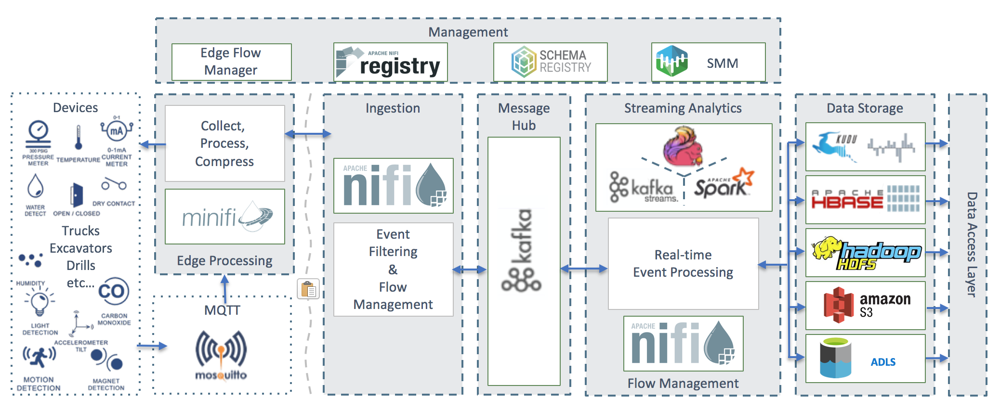

= CDF Tech Bootcamp

== Introduction

In this hands-on bootcamp, you will build a full OT to IT workflow for an **IoT Predictive Maintenance** use case. Below is the architecture diagram, showing all the components you will setup over the next 12 lab exercises. While the diagram divides the components according to their location (factory, regional or datacenter level) in this workshop all such components will reside in one single host.

===== Labs summary:

* *Lab 1* - On the Gateway host, run a simulator to send IoT sensors data to the MQTT broker.
* *Lab 2* - On the Gateway host, configure and start **MiNiFi**, which will read from the MQTT broker, filter and forward to the **NiFi** cluster.
* *Lab 3* - Create the MiNiFi flow on the Edge Flow Manager and publish it for the MiNiFi agent to start sending data to the NiFi cluster.
* *Lab 4* - On Schema Registry, register the schema describing the data generated by the IoT sensors.
* *Lab 5* - On the NiFi cluster, prepare the data and send it to the **Kafka** cluster.
* *Lab 6* - On the *Streams Messaging Manager (SMM)* Web UI, monitor the Kafka cluster and confirm data is being ingested correctly.
* *Lab 7* - Use the Edge Flow Manager to update existing edge flows and perform additional processing on the edge
* *Lab 8* - Use NiFi to process each record, calling the **Model endpoint** and save results to **Kudu**.
* *Lab 9* - On the CDH cluster, process each record using **Spark Streaming**, calling the **Model endpoint** and save results to **Kudu**.
* *Lab 10* - On the CDH cluster, pull reports on upcoming predicted machine failures using **Impala** and **Hue**.
* *Lab 11* - On the **CDSW** cluster, train your model with the **Experiment** feature.
* *Lab 12* - On the **CDSW** cluster, deploy the model into production with the **Model** feature.

===== Pre-requisites

* Laptop with a supported OS (Windows 7 not supported).
* Ability to SSH into remote hosts from Windows or Mac. For Windows machines, install Putty or even better link:https://docs.microsoft.com/en-us/windows-server/administration/openssh/openssh_install_firstuse[install OpenSSH for PowerShell].
* A modern browser like Google Chrome (IE not supported).

== Connecting to your cluster

You instructor will give access to a registration link where you can request a cluster. You should have 2 addresses for you one-node cluster: the public DNS name and the public IP address. With those addresses you can test the following connectivity to your cluster:

. Ensure you can connect to the following service using your browser:
+
[%autowidth,options="header"]
|===
|Service|URL|Credentials
|Cloudera Manager|http://<public_dns>:7180/|`admin/admin`
|Edge Flow Manager|http://<public_dns>:10080/efm/ui/|
|NiFi|http://<public_dns>:8080/nifi/|
|NiFi Registry|http://<public_dns>:18080/nifi-registry/|
|Schema Registry|http://<public_dns>:7788/|
|SMM|http://<public_dns>:9991/|
|Hue|http://<public_dns>:8888/|
|CDSW|http://cdsw.<public_IP>.nip.io/|`admin/supersecret1`
|===
. Login into *Cloudera Manager* and familiarize yourself with the services installed
. Login into *Hue*. As you are the first user to login into Hue, you are granted admin privileges. At this point, you won't need to do anything on Hue, but by logging in, CDH has created your HDFS user and folder, which you will need for the next lab.

Below a screenshot of Chrome open with 8 tabs, one for each service.

image::images/browser.png[width=800]

=== Ensure you can SSH into the cluster from Linux/Macos

From the registration link, download the PEM key required to access to your cluster with SSH. Run the following command:

----
chmod 400 workshop.pem
ssh -i workshop.pem centos@you-ip-address
----

=== Ensure you can SSH into the cluster from Windows
From the registration link, download the PEM key required to access to your cluster with SSH. We will use Putty to connect to the cluster. However, Putty doesn't accept PEM key. Follow these instructions to convert your PEM key into a PPK key and connect to the cluster

Convert your key with Puttygen:

. Use puttygen to convert .PEM file to .PPK file.
. Start puttygen and select “Load”
. Select your .PEM file.
. Putty will convert the .PEM format to .PPK format.
. Select “Save Private Key” A passphrase is not required but can be used if additional security is required.

Connect with Putty:

. Launch Putty and enter the host IP address.
. Navigate to Connection/SSH/Auth
. Click “Browse” and select the .PPK file you exported from puttygen.
. Click “Open.”

== Labs
* From Edge to Streams Processing (Lab 1 to Lab 8) : https://github.com/ahadjidj/edge2ai-workshop/blob/master/streaming.adoc
* Analytics and Data Science (Lab 9 to Lab 12) : https://github.com/ahadjidj/edge2ai-workshop/blob/master/datascience.adoc

== Resources
  
* link:https://medium.freecodecamp.org/building-an-iiot-system-using-apache-nifi-mqtt-and-raspberry-pi-ce1d6ed565bc[Original blog by Abdelkrim Hadjidj]

* This workshop was based on the following work by Fabio Ghirardello:
** https://github.com/fabiog1901/IoT-predictive-maintenance
** https://github.com/fabiog1901/OneNodeCDHCluster

* link:https://www.cloudera.com/documentation.html[Cloudera Documentation]

== Troubleshooting

==== *CEM doesn't pick up new NARs*

. Delete the agent manifest manually using the EFM API:

. Verify each class has the same agent manifest ID:
+
[source]
----
http://hostname:10080/efm/api/agent-classes
[{"name":"iot1","agentManifests":["agent-manifest-id"]},{"name":"iot4","agentManifests":["agent-manifest-id"]}]
----

. Confirm the manifest doesn't have the NAR you installed
+
[source]
----
http://hostname:10080/efm/api/agent-manifests?class=iot4
[{"identifier":"agent-manifest-id","agentType":"minifi-java","version":"1","buildInfo":{"timestamp":1556628651811,"compiler":"JDK 8"},"bundles":[{"group":"default","artifact":"system","version":"unversioned","componentManifest":{"controllerServices":[],"processors":
----

. Call the API endpoint:
+
[source]
----
http://hostname:10080/efm/swagger/
----

. Hit the `DELETE - Delete the agent manifest specified by id` button, and in the id field, enter `agent-manifest-id`

